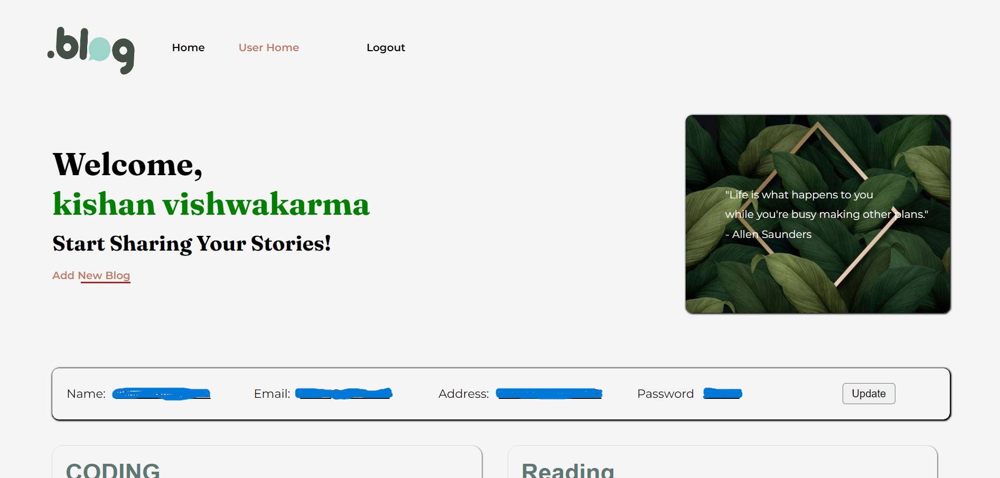

# Blog-Application:-
## This Spring Boot application implements a user-friendly blog management system with the following features:
## URL to get the home page is -> http://localhost:4000/

## User Management:
  User registration
  User login with authentication
  User profile management (update details)

## Blog Management:
  Create new blog posts
  View existing blog posts
  Update blog posts
  Delete blog posts

# Technology Stack:
## Backend:
  Spring Boot
  Java
  JPA (Data persistence)
  Oracle Database (data storage)
## Dependencies
   Spring Web
   Spring Boot DevTools
   Oracle Driver
   Spring Data JPA
   ojdbc6
   jakarta servlet api
   taglibs

# Usage:
## User Registration:
Navigate to the registration endpoint (e.g., http://localhost:4000/register). Fill your details to register

## User Login:
Navigate to the login endpoint (e.g., http://localhost:4000/login). Provide your registered username and password to log in.

## Blog Management (after login):
Use the provided API endpoints to create, view, update, and delete blog posts. The specific endpoints may vary depending on your implementation, but they should follow RESTful design principles.

## Images of user-interface of this application:
**Home Page** 

**SignIn Page**

**LogIn Page**

**UserHome Page**

**Add Blog Page**

**Update Blog Page**

# Feel free to contribute:
This project is open-source! I welcome your contributions to improve the functionality and features of the Blog Application.
